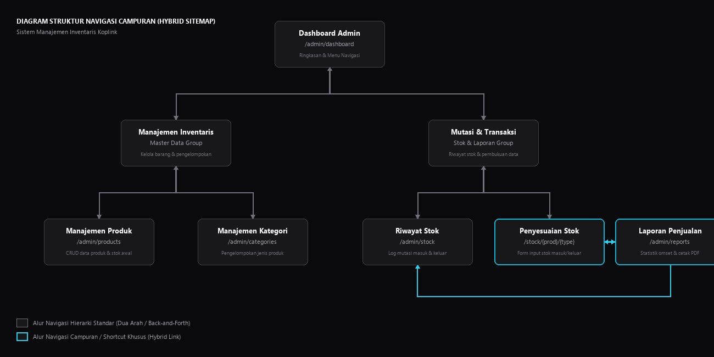

# Dokumentasi Struktur Navigasi Sistem Manajemen Inventaris Koplink

Dokumen ini memetakan seluruh struktur navigasi dan rute pada aplikasi **Koplink** yang telah disederhanakan menjadi **Sistem Manajemen Inventaris Internal (Murni Inventory)**. Seluruh akses dibatasi khusus untuk pengguna administratif terotentikasi demi melindungi data stok barang.

---

## 1. Peta Navigasi & Tingkat Akses

Sistem menggunakan alur navigasi satu tingkat akses (**Administrator terproteksi**) menggunakan tata letak utama `resources/views/layouts/admin.blade.php`.

### A. Area Publik (Sebelum Login)
*   **Halaman Login** (`/login`)
    *   *Controller:* `AuthController@showLogin` & `login`
    *   *View:* `resources/views/auth/login.blade.php`
    *   *Deskripsi:* Gerbang otentikasi utama bagi admin untuk memasukkan Email dan Password.
*   **Pengalihan Utama** (`/`)
    *   *Aksi:* Secara otomatis mengalihkan semua pengguna yang belum terotentikasi langsung ke halaman `/login`.

### B. Area Internal (Sesudah Login - Middleware `auth`)
*   **Dashboard** (`/admin/dashboard`)
    *   *Controller:* `DashboardController@index`
    *   *View:* `resources/views/admin/dashboard.blade.php`
    *   *Deskripsi:* Ringkasan eksekutif berisi total produk, total stok barang, daftar produk dengan stok menipis (di bawah batas minimum), dan aktivitas penyesuaian stok terbaru.
*   **Manajemen Produk (Products CRUD)** (`/admin/products`)
    *   *Daftar Produk* (`/admin/products` -> `AdminProductController@index`)
    *   *Tambah Produk Baru* (`/admin/products/create` -> `AdminProductController@create`)
    *   *Edit Produk* (`/admin/products/{product}/edit` -> `AdminProductController@edit`)
*   **Manajemen Kategori (Categories CRUD)** (`/admin/categories`)
    *   *Daftar Kategori* (`/admin/categories` -> `CategoryController@index`)
    *   *Tambah Kategori Baru* (`/admin/categories/create` -> `CategoryController@create`)
    *   *Edit Kategori* (`/admin/categories/{category}/edit` -> `CategoryController@edit`)
*   **Mutasi & Riwayat Stok (Stock Tracking)** (`/admin/stock`)
    *   *Log Transaksi Stok* (`/admin/stock` -> `StockController@history`)
        *   *View:* `resources/views/admin/stock/history.blade.php`
        *   *Deskripsi:* Menampilkan catatan lengkap masuk/keluarnya barang beserta komentar alasan penyesuaian.
    *   *Form Penyesuaian Stok* (`/admin/stock/{product}/{type}` -> `StockController@form`)
        *   *View:* `resources/views/admin/stock/form.blade.php`
        *   *Parameter:* `{type}` dapat bernilai `in` (stok masuk) atau `out` (stok keluar).
        *   *Deskripsi:* Formulir untuk menambah atau mengurangi jumlah stok fisik barang secara manual.
*   **Laporan Penjualan & Cetak PDF** (`/admin/reports`)
    *   *Controller:* `ReportController@index`
    *   *View:* `resources/views/admin/reports/index.blade.php`
    *   *Deskripsi:* Halaman untuk meninjau grafik penjualan, memfilter transaksi berdasarkan rentang tanggal tertentu, dan mengekspor dokumen laporan penjualan ke format PDF.
*   **Log Out** (`POST /logout`)
    *   *Aksi:* Menghapus sesi aktif admin dan mengarahkan kembali ke `/login`.

---

## 2. Diagram Alir Navigasi (Sitemap Diagram)

Berikut adalah diagram alir navigasi visual **Struktur Navigasi Campuran (Hybrid Navigation Structure)** yang telah diselaraskan dengan alur sistem:



### Diagram Alir Teknis (Mermaid)

Alur perpindahan halaman digambarkan menggunakan diagram Mermaid di bawah ini:

```mermaid
graph TD
    %% Styling
    classDef default fill:#18181b,stroke:#3f3f46,stroke-width:1px,color:#f4f4f5;
    classDef parent fill:#18181b,stroke:#52525b,stroke-width:1.5px,color:#f4f4f5;
    classDef hybrid fill:#18181b,stroke:#06b6d4,stroke-width:2px,color:#f4f4f5;
    
    %% Nodes
    Dashboard[Dashboard Admin <br/> /admin/dashboard]
    
    %% Level 2
    Inventaris[Manajemen Inventaris <br/> Master Data Group]
    Mutasi[Mutasi & Transaksi <br/> Stok & Laporan Group]
    
    %% Level 3
    Produk[Manajemen Produk <br/> /admin/products]
    Kategori[Manajemen Kategori <br/> /admin/categories]
    Riwayat[Riwayat Stok <br/> /admin/stock]
    Penyesuaian[Penyesuaian Stok <br/> /stock/{prod}/{type}]
    Laporan[Laporan Penjualan <br/> /admin/reports]
    
    %% Hierarchical Links (Back and Forth)
    Dashboard <--> Inventaris
    Dashboard <--> Mutasi
    
    Inventaris <--> Produk
    Inventaris <--> Kategori
    
    Mutasi <--> Riwayat
    Mutasi <--> Penyesuaian
    
    %% Hybrid Shortcut Links (Accent)
    Penyesuaian <-->|Shortcut Transaksi/Laporan| Laporan
    Laporan -->|Detail Log Mutasi| Riwayat
    
    class Dashboard parent;
    class Inventaris,Mutasi parent;
    class Produk,Kategori,Riwayat default;
    class Penyesuaian,Laporan hybrid;
    
    linkStyle 8,9 stroke:#22d3ee,stroke-width:2px;
```

---

## 3. Detail Rute Teknis (Web Routes Mapping)

Berikut adalah tabel rute resmi yang terdaftar dan aktif di sistem untuk melayani manajemen inventaris internal:

| Rute URL | Nama Rute (Route Name) | Pengontrol & Aksi (Action) | Deskripsi Fungsional |
| :--- | :--- | :--- | :--- |
| `/login` | `login` | `AuthController@showLogin` / `login` | Form login & proses otentikasi admin |
| `/admin/dashboard` | `admin.dashboard` | `DashboardController@index` | Ringkasan statistik & indikator stok |
| `/admin/products` | `admin.products.index` | `AdminProductController@index` | Tabel manajemen seluruh produk kopi |
| `/admin/products/create` | `admin.products.create` | `AdminProductController@create` | Form pendaftaran produk baru |
| `/admin/products/{product}` | `admin.products.update` | `AdminProductController@update` / `destroy` | Aksi memperbarui / menghapus produk |
| `/admin/products/{product}/edit`| `admin.products.edit` | `AdminProductController@edit` | Form pengeditan informasi produk |
| `/admin/categories` | `admin.categories.index`| `CategoryController@index` | Tabel manajemen kategori produk |
| `/admin/categories/create`| `admin.categories.create`| `CategoryController@create`| Form pembuatan kategori baru |
| `/admin/categories/{category}/edit`| `admin.categories.edit`| `CategoryController@edit` | Form pengeditan nama kategori |
| `/admin/stock` | `admin.stock.history` | `StockController@history` | Log riwayat transaksi stok barang |
| `/admin/stock/{product}/{type}` | `admin.stock.form` | `StockController@form` / `store` | Form & aksi penyesuaian stok masuk/keluar |
| `/admin/reports` | `admin.reports.index` | `ReportController@index` | Laporan, filter grafik, dan ekspor PDF |
| `/logout` | `logout` | `AuthController@logout` | Aksi keluar dan menghapus sesi aktif |
